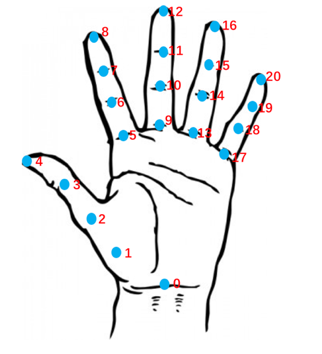

# DigitRatio

## 文件说明

```shell
.
|-- images：存放待检测图像文件
|-- models：
|   |-- model_a: [OpenPose](https://github.com/CMU-Perceptual-Computing-Lab/openpose)
|   |-- model_b: [BaiduAI](https://ai.baidu.com/tech/body/hand)
|-- requirements.txt:
|-- find_circle.py:
|-- hand_detect.py:
```

备注：

* 图像为jpeg格式

## 使用

1. ESIEC2019数据预处理：
    * 去除不含手掌的照片
    * ESIEC2019logo贴纸以3cm为标准

0. python3环境之下

0. pip install -r requirements.txt

0. python find_dircle.py
    运行结果：
    生成images_preprocessed文件夹

    ```shell
    images_preprocessed
    |-- images_list.txt: images文件夹下图片列表
    |-- images_radius.txt: 检测出logo的图片列表及logo的像素半径
    |-- images_without_logo.txt: 未检测出logo的图片列表
    |-- images_cropped/: 检测出logo的图片。相比原始缩小0.5倍，并进行了裁剪边缘和旋转操作。logo半径计算以图片中识别到的最大蓝色圆圈为准。

    ```

0. python hand_detect.py
    运行结果：
    生成images_result文件夹

    ```shell
    images_result
    |-- images_result_1:        模型1计算的像素长度：2D/4D，拇指，食指，中指，无名指，小指
    |-- images_result_2:        模型2计算的像素长度：2D/4D，拇指，食指，中指，无名指，小指
    |-- images_final_result_1:  模型1的实际长度：2D/4D，拇指，食指，中指，无名指，小指
    |-- images_final_result_2:  模型2的实际长度：2D/4D，拇指，食指，中指，无名指，小指
    |-- images_failure_1:       模型1检测失败的图片列表
    |-- images_failure_2:       模型2检测失败的图片列表
    |-- images_keypoints_1:     模型1检测的21个关键点坐标(x,y)
    |-- images_keypoints_2:     模型2检测的21个关键点坐标(x,y)
    |-- images_visualiztion:    处理后图片的可视化结果。apid为关键点测量图，apis为标识了长度的关键点测量图
    ```

    备注：
    * 对于没有检测到logo的图片，以平均logo像素半径作为参考计算手指的实际长度
    * 关键点坐标图示如下
    
